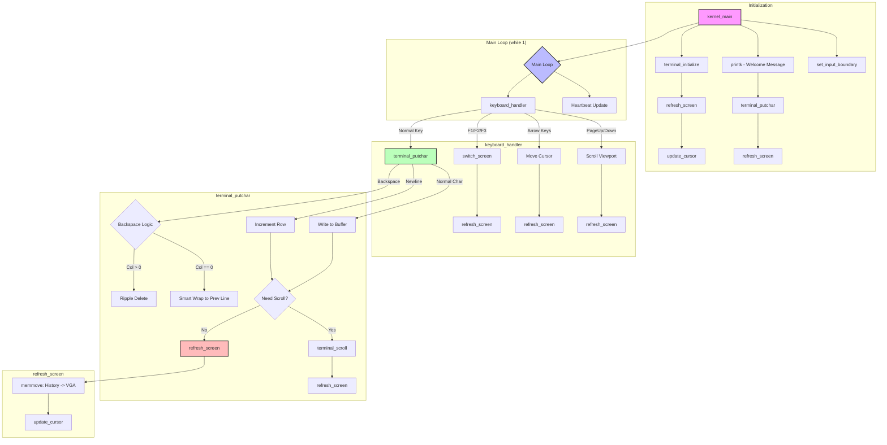

# KFS-1 Architecture Guide

A comprehensive guide to understanding the KFS-1 kernel project. This document explains every concept, file, and function for developers who want to understand or contribute to the codebase.

---

## Table of Contents

1.  [Project Overview](#project-overview)
2.  [Key Concepts](#key-concepts)
3.  [File Structure](#file-structure)
4.  [Boot Flow](#boot-flow)
5.  [Code Walkthrough](#code-walkthrough)
6.  [Building & Running](#building--running)

---

## Project Overview

**KFS-1** (Kernel From Scratch - 1) is a minimal, 32-bit x86 kernel written in C and Assembly. Its purpose is to demonstrate the fundamentals of operating system development:

-   **Bare-metal execution**: The code runs directly on the CPU without any underlying OS.
-   **VGA Text Mode**: Characters are displayed by writing directly to video memory.
-   **Keyboard Input**: Key presses are read by polling hardware I/O ports.
-   **No Standard Library**: `libc` does not exist; all utilities (`memmove`, `strlen`, `printk`) are custom-built.

### Features Implemented (Bonuses)

| Feature | Description |
|---|---|
| **Scrollback History** | A 100-line buffer preserves text that scrolls off the visible 25-line screen. |
| **Virtual Screens (F1-F3)** | Three independent terminal sessions, switchable via function keys. |
| **Color Support** | Each screen has a unique color theme (Grey, Green, Cyan). |
| **Cursor Movement** | Arrow keys navigate within the editable area. |
| **`printk`** | A `printf`-like function supporting `%s`, `%d`, `%x`, `%c`. |
| **Heartbeat Spinner** | A visual indicator (rotating `|/-\`) proving the kernel is running. |

---

## Key Concepts

### 1. Multiboot Specification

The [Multiboot Specification](https://www.gnu.org/software/grub/manual/multiboot/multiboot.html) is a standard that allows any compliant bootloader (like GRUB) to load any compliant kernel. Our kernel uses Multiboot v1.

**How it works:**
1.  GRUB reads the ISO.
2.  It finds a "magic number" (`0x1BADB002`) in the kernel binary's first 8KB.
3.  If found, GRUB loads the kernel into memory and jumps to the entry point (`_start`).

### 2. VGA Text Mode

In text mode, the video card maps an 80x25 character grid to a fixed memory address: `0xB8000`.

**Memory Layout:**
-   Each cell is 2 bytes (1 word):
    -   **Byte 0 (Low):** ASCII character code.
    -   **Byte 1 (High):** Color attribute (4-bit foreground + 4-bit background).
-   Total: `80 cols * 25 rows * 2 bytes = 4000 bytes`.

```c
// Example: Write a white 'A' on blue background at (0, 0)
uint16_t* vga = (uint16_t*)0xB8000;
vga[0] = 'A' | (0x1F << 8); // 0x1F = white (F) on blue (1)
```

### 3. Hardware I/O Ports

The CPU communicates with hardware (keyboard, VGA cursor) via "I/O Ports". These are special addresses accessed with `in` and `out` assembly instructions.

| Port | Purpose |
|---|---|
| `0x60` | Keyboard: Read scancode. |
| `0x64` | Keyboard: Read status register. |
| `0x3D4, 0x3D5` | VGA: Cursor position control. |

### 4. Polling vs. Interrupts

This kernel uses **polling**: it continuously checks the keyboard status port (`0x64`) in a loop to see if a key was pressed. This is simpler but less efficient than **interrupt-driven** I/O (which requires setting up an Interrupt Descriptor Table, or IDT).

---

## File Structure

```
kfs-1/
├── boot.S           # Assembly entry point (Multiboot header, stack setup)
├── kernel.c         # Main kernel logic (terminal, keyboard, printk)
├── linker.ld        # Linker script (memory layout)
├── io.h             # I/O port helpers (inb, outb)
├── keyboard.h       # US keyboard scancode map
├── Makefile         # Build automation
├── Dockerfile       # Docker environment for `grub-mkrescue`
└── ARCHITECTURE.md  # This file
```

---

## Boot Flow

The execution sequence from power-on to the main loop is:

```
┌─────────────────┐
│      BIOS       │
└────────┬────────┘
         │ Loads GRUB from ISO
         ▼
┌─────────────────┐
│      GRUB       │
└────────┬────────┘
         │ Finds Multiboot header
         │ Loads kfs.bin to memory (at 1MB)
         │ Jumps to `_start`
         ▼
┌─────────────────┐
│ boot.S: _start  │
└────────┬────────┘
         │ 1. Set stack pointer (`esp = stack_top`)
         │ 2. Reset EFLAGS
         │ 3. Push Multiboot info (eax, ebx)
         │ 4. `call kernel_main`
         ▼
┌─────────────────┐
│   kernel_main   │
└────────┬────────┘
         │ 1. `terminal_initialize()`
         │ 2. Print welcome message
         │ 3. `set_input_boundary()`
         │ 4. `cli` (disable interrupts)
         │ 5. Enter infinite loop:
         │    ├── `keyboard_handler()`
         │    └── Update heartbeat spinner
         ▼
┌─────────────────┐
│  Infinite Loop  │
└─────────────────┘
```

---

## Code Walkthrough

### Execution Flow Diagram: `kernel.c`



**Legend:**
- **Pink**: Entry point (`kernel_main`)
- **Blue**: Main loop
- **Green**: Character output logic
- **Red**: Screen refresh (critical path)

---

### Step-by-Step Execution Order: `kernel.c`

This section describes the **exact order** in which code executes when the kernel runs, with line numbers for reference.

#### Phase 1: Global Initialization (Before `kernel_main`)

When the kernel binary is loaded, the following global variables are initialized:

| Order | Line | Code | What Happens |
|:---:|:---:|---|---|
| 1 | 12-14 | `VGA_WIDTH`, `VGA_HEIGHT`, `HISTORY_LINES` | Constants are set (80, 25, 100). |
| 2 | 15 | `vga_buffer = 0xB8000` | Pointer to VGA memory is set. |
| 3 | 28 | `screens[3]` | Array of 3 `ScreenState` structs is allocated (uninitialized). |
| 4 | 29 | `current_screen = 0` | Active screen index set to 0. |
| 5 | 30-35 | `terminal_row`, etc. | Global "working copy" variables (uninitialized, set later). |
| 6 | 38-39 | `input_start_row/col = 0` | Input protection boundary initialized. |

---

#### Phase 2: Entry Point (`kernel_main`, Line 474)

Called by `boot.S` after stack setup. Execution proceeds **sequentially**:

| Order | Line | Code | What Happens |
|:---:|:---:|---|---|
| 7 | 476 | `terminal_initialize()` | **Jump to Line 119.** See Phase 2a. |
| 8 | 478-483 | `printk(...)` × 5 | Print welcome messages. Each calls `terminal_putchar` for every character. See Phase 3. |
| 9 | 486-487 | `set_input_boundary()` | **Jump to Line 184.** Saves current `terminal_row`/`terminal_column` as the "no delete" barrier. |
| 10 | 491 | `asm volatile("cli")` | Disable CPU interrupts (we are polling). |
| 11 | 493-496 | Spinner setup | Local variables for heartbeat animation. |
| 12 | 499 | Flush keyboard | Read and discard any pending keypresses. |
| 13 | 501 | `while(1)` | **Enter infinite main loop.** See Phase 4. |

---

#### Phase 2a: `terminal_initialize()` (Line 119)

| Order | Line | Code | What Happens |
|:---:|:---:|---|---|
| 7.1 | 121 | `for(int i=0; i<3; i++)` | Loop over 3 screens. |
| 7.2 | 122-127 | `screens[i].row = 0`, etc. | Zero out cursor position, viewport, boundaries. |
| 7.3 | 130-132 | Color assignment | Screen 0: Grey. Screen 1: Green. Screen 2: Cyan. |
| 7.4 | 133-137 | Nested loop | Fill entire 100-line history buffer with blank spaces (8000 entries per screen). |
| 7.5 | 140-143 | Load screen 0 | Copy `screens[0]` state to global working variables. |
| 7.6 | 145 | `refresh_screen()` | **Jump to Line 105.** Copy viewport to VGA. See Phase 2b. |

---

#### Phase 2b: `refresh_screen()` (Line 105)

| Order | Line | Code | What Happens |
|:---:|:---:|---|---|
| 7.6.1 | 106 | `history = screens[current_screen].buffer` | Get pointer to current screen's history. |
| 7.6.2 | 108 | `start_offset = terminal_view_row * 80` | Calculate where viewport starts in buffer. |
| 7.6.3 | 113 | `memmove(vga_buffer, ...)` | Copy 4000 bytes (25 lines × 80 cols × 2 bytes) to VGA memory at `0xB8000`. |
| 7.6.4 | 116 | `update_cursor(...)` | **Jump to Line 81.** See Phase 2c. |

---

#### Phase 2c: `update_cursor()` (Line 81)

| Order | Line | Code | What Happens |
|:---:|:---:|---|---|
| 7.6.4.1 | 83 | `physical_row = y - terminal_view_row` | Calculate cursor's position relative to viewport. |
| 7.6.4.2 | 85-90 | If visible | Write cursor position to VGA ports `0x3D4`/`0x3D5` using `outb()`. |
| 7.6.4.3 | 91-98 | Else | Move cursor off-screen (position 2000). |

---

#### Phase 3: `printk()` → `terminal_putchar()` (Lines 297, 189)

For each character in the format string:

| Order | Line | Code | What Happens |
|:---:|:---:|---|---|
| 8.n | 301-304 | `for (p = format; ...)` | Iterate through format string. |
| 8.n.1 | 303 | `terminal_putchar(*p)` | **Jump to Line 189.** |
| 8.n.1.1 | 190 | `history = ...buffer` | Get current screen's buffer. |
| 8.n.1.2 | 192-194 | If `\n` | Increment `terminal_row`, reset `terminal_column` to 0. |
| 8.n.1.3 | 195-265 | If `\b` | Complex backspace logic (ripple delete, wrap, etc.). |
| 8.n.1.4 | 266-268 | Else | Write character to `history[row * 80 + col]`, increment column. |
| 8.n.1.5 | 271-274 | Column overflow | If `col >= 80`, wrap to next row. |
| 8.n.1.6 | 277-281 | Scroll check | If `row >= 100`, call `terminal_scroll()`. If `row >= view_row + 25`, scroll viewport. |
| 8.n.1.7 | 283 | `refresh_screen()` | Update VGA. |

---

#### Phase 4: Main Loop (`while(1)`, Line 501)

This loop runs **forever**, polling for input:

| Order | Line | Code | What Happens |
|:---:|:---:|---|---|
| ∞.1 | 502 | `keyboard_handler()` | **Jump to Line 381.** See Phase 4a. |
| ∞.2 | 506-520 | Heartbeat | Every 10000 iterations, update spinner at `(0, 79)`. |

---

#### Phase 4a: `keyboard_handler()` (Line 381)

| Order | Line | Code | What Happens |
|:---:|:---:|---|---|
| ∞.1.1 | 383 | `status = inb(0x64)` | Read keyboard status port. |
| ∞.1.2 | 386 | `if (status & 0x01)` | Check if data is available. |
| ∞.1.3 | 387 | `scancode = inb(0x60)` | Read the scancode. |
| ∞.1.4 | 390-391 | Key release check | If bit 7 is set, key was released (ignored). |
| ∞.1.5 | 396-398 | F1/F2/F3 | Calls `switch_screen(0/1/2)`. See Phase 4b. |
| ∞.1.6 | 402-420 | Arrow keys | Modify `terminal_row`/`terminal_column`, call `refresh_screen()`. |
| ∞.1.7 | 421-432 | Up/Down | Move cursor vertically with boundary checks. |
| ∞.1.8 | 447-462 | PageUp/PageDown | Modify `terminal_view_row`, call `refresh_screen()`. |
| ∞.1.9 | 466-467 | Normal key | Look up ASCII in `kbdus[]`, call `terminal_putchar()`. |

---

#### Phase 4b: `switch_screen()` (Line 354)

| Order | Line | Code | What Happens |
|:---:|:---:|---|---|
| S.1 | 355 | Early exit | If already on this screen, return. |
| S.2 | 358-363 | Save state | Copy globals (`terminal_row`, etc.) to `screens[current_screen]`. |
| S.3 | 367 | `current_screen = index` | Change active screen index. |
| S.4 | 370-375 | Load state | Copy `screens[index]` to globals. |
| S.5 | 377 | `refresh_screen()` | Draw new screen's viewport to VGA. |

---

#### Summary: Complete Execution Timeline

```
BOOT → _start (boot.S)
         │
         └──► kernel_main (L474)
                 │
                 ├──► terminal_initialize (L119)
                 │       ├──► [Loop: Init 3 screens]
                 │       └──► refresh_screen (L105)
                 │               └──► update_cursor (L81)
                 │
                 ├──► printk × 5 (L478-483)
                 │       └──► [Loop: terminal_putchar per char]
                 │               └──► refresh_screen
                 │
                 ├──► set_input_boundary (L184)
                 │
                 ├──► cli (disable interrupts)
                 │
                 └──► while(1) FOREVER
                         │
                         ├──► keyboard_handler (L381)
                         │       ├──► switch_screen? → refresh_screen
                         │       ├──► arrow keys? → refresh_screen
                         │       ├──► PageUp/Down? → refresh_screen
                         │       └──► normal key? → terminal_putchar
                         │                               └──► refresh_screen
                         │
                         └──► Heartbeat spinner update
```

---

### File: `boot.S` — Step-by-Step Execution

**Purpose:** The Multiboot header and assembly entry point. This is the **first code that runs** after GRUB loads the kernel.

#### Line-by-Line Breakdown

| Line | Code | What Happens |
|:---:|---|---|
| 6-10 | `.set ALIGN, MEMINFO, FLAGS, MAGIC, CHECKSUM` | Define constants for the Multiboot header. |
| 9 | `MAGIC = 0x1BADB002` | The "magic number" GRUB searches for. |
| 10 | `CHECKSUM = -(MAGIC + FLAGS)` | Ensures header integrity (must sum to 0). |

**Section: `.multiboot` (Lines 13-17)**

| Line | Code | What Happens |
|:---:|---|---|
| 14 | `.align 4` | Align to 4-byte boundary (required by Multiboot). |
| 15-17 | `.long MAGIC, FLAGS, CHECKSUM` | The actual header bytes GRUB reads. |

**Section: `.bss` (Lines 20-24)**

| Line | Code | What Happens |
|:---:|---|---|
| 21 | `.align 16` | Align stack to 16-byte boundary (x86 calling convention). |
| 22-24 | `stack_bottom`, `.skip 16384`, `stack_top` | Reserve 16KB of uninitialized memory for the kernel stack. |

**Section: `.text` — Entry Point `_start` (Lines 27-63)**

| Line | Code | What Happens |
|:---:|---|---|
| 28-29 | `.global _start` | Export `_start` as the entry point symbol. |
| 32 | `mov $stack_top, %esp` | **Set stack pointer.** The CPU needs a stack for function calls. |
| 38-39 | `pushl $0; popf` | **Reset EFLAGS.** Clears all CPU flags to a known state. |
| 42 | `pushl %ebx` | Push pointer to Multiboot info structure (passed by GRUB). |
| 44 | `pushl %eax` | Push Multiboot magic value (should be `0x2BADB002`). |
| 47 | `call kernel_main` | **Jump to C code.** Execution continues in `kernel.c`. |
| 59-61 | `cli; hlt; jmp 1b` | If `kernel_main` ever returns, halt the CPU forever. |

#### Execution Flow

```
GRUB → Jumps to _start
         │
         ├──► Set ESP = stack_top (Line 32)
         │
         ├──► Reset EFLAGS (Lines 38-39)
         │
         ├──► Push EBX, EAX (Multiboot info) (Lines 42-44)
         │
         └──► CALL kernel_main (Line 47)
                 │
                 └──► [Execution continues in kernel.c]
```

---

### File: `linker.ld` — Step-by-Step Explanation

**Purpose:** Tells the linker how to arrange sections in the final binary. Without this, the kernel would not be loadable.

#### Line-by-Line Breakdown

| Line | Code | What Happens |
|:---:|---|---|
| 7 | `ENTRY(_start)` | Tells the linker that `_start` is the entry point. The ELF header will point here. |
| 15 | `. = 1M` | **Set load address to 1MB.** This is a convention for x86 kernels (below 1MB is reserved for BIOS, VGA, etc.). |

**Section Definitions (Lines 20-43)**

| Line | Section | What Goes Here |
|:---:|---|---|
| 20-24 | `.text` | Executable code. Includes `.multiboot` (must be early!) and all functions. |
| 27-30 | `.rodata` | Read-only data. String literals, constants. |
| 33-36 | `.data` | Initialized global variables. |
| 39-43 | `.bss` | Uninitialized data (zero-filled). Includes the stack. |

#### Memory Layout (After Linking)

```
Address         Section
───────────────────────────
0x00100000 (1MB)  .text (code)
                  .rodata (constants)
                  .data (globals)
                  .bss (stack, uninitialized)
───────────────────────────
```

> [!IMPORTANT]
> The `.multiboot` section is placed FIRST inside `.text` so GRUB can find the magic number within the first 8KB of the binary.

---

### File: `io.h` — Step-by-Step Explanation

**Purpose:** Provides inline assembly wrappers for CPU I/O port instructions. These are essential for communicating with hardware.

#### Line-by-Line Breakdown

**Function: `outb(port, val)` (Lines 10-13)**

| Line | Code | What Happens |
|:---:|---|---|
| 10 | `static inline void outb(...)` | Inline function (no function call overhead). |
| 12 | `__asm__ volatile("outb %0, %1" ...)` | Execute the `OUT` instruction. |
| 12 | `: : "a"(val), "Nd"(port)` | `val` goes in `AL` register, `port` goes in `DX` (or immediate). |

**Function: `inb(port)` (Lines 19-26)**

| Line | Code | What Happens |
|:---:|---|---|
| 19 | `static inline uint8_t inb(...)` | Inline function returning a byte. |
| 21 | `uint8_t ret;` | Variable to hold the result. |
| 22-24 | `__asm__ volatile("inb %1, %0" ...)` | Execute the `IN` instruction. |
| 23 | `: "=a"(ret)` | Output: result stored in `AL`, copied to `ret`. |
| 24 | `: "Nd"(port)` | Input: port number. |
| 25 | `return ret;` | Return the byte read from the port. |

#### How These Are Used

| Function | Used For |
|---|---|
| `outb(0x3D5, pos)` | Set VGA cursor position. |
| `outb(0x3D4, 0x0F)` | Select VGA cursor low byte register. |
| `inb(0x60)` | Read keyboard scancode. |
| `inb(0x64)` | Read keyboard status register. |

---

### File: `keyboard.h` — Step-by-Step Explanation

**Purpose:** Maps keyboard scancodes (raw hardware codes) to ASCII characters.

#### Line-by-Line Breakdown

| Line | Code | What Happens |
|:---:|---|---|
| 5 | `unsigned char kbdus[128] = {...}` | Declare a 128-element array for scancode → ASCII mapping. |
| 7 | `0, 27, '1', '2', ...` | Index 0: unused. Index 1: ESC (ASCII 27). Index 2-11: number row. |
| 8 | `'\\b'` | Index 14: Backspace key. |
| 9 | `'\\t'` | Index 15: Tab key. |
| 11 | `'\\n'` | Index 28: Enter key. |
| 14-15 | `'\\'', '\\\\', ...` | Quote, backslash, and other special characters. |
| 19 | `' '` | Index 57: Space bar. |
| 21-42 | `0, 0, 0, ...` | Function keys, arrow keys, etc. are mapped to 0 (handled separately in code). |

#### How Scancodes Work

When you press a key:
1.  The keyboard controller sends a **scancode** to I/O port `0x60`.
2.  `keyboard_handler()` reads it with `inb(0x60)`.
3.  It looks up `kbdus[scancode]` to get the ASCII character.
4.  If it's 0, the key is special (F1, Arrow, etc.) and handled with `if` statements.

#### Scancode Examples

| Key | Scancode | `kbdus[scancode]` |
|---|:---:|---|
| `A` | 0x1E (30) | `'a'` |
| `Enter` | 0x1C (28) | `'\n'` |
| `Backspace` | 0x0E (14) | `'\b'` |
| `F1` | 0x3B (59) | `0` (handled specially) |
| `Up Arrow` | 0x48 (72) | `0` (handled specially) |

---

### File: `Makefile` — Step-by-Step Explanation

**Purpose:** Automates the build process. Defines how to compile, link, and run the kernel.

#### Variables (Lines 1-33)

| Line | Variable | Purpose |
|:---:|---|---|
| 1 | `CC = gcc` | C compiler. |
| 2 | `AS = as` | GNU assembler. |
| 3 | `LD = ld` | GNU linker. |
| 14 | `CFLAGS = -m32 -ffreestanding ...` | Compiler flags for bare-metal 32-bit code. |
| 18 | `ASFLAGS = --32` | Assembler flag for 32-bit mode. |
| 23 | `LDFLAGS = -m elf_i386 -T linker.ld` | Linker flags: 32-bit ELF, use custom linker script. |
| 31-32 | `KERNEL`, `ISO` | Output filenames: `kfs.bin`, `kfs.iso`. |

#### Targets (Lines 36-89)

| Target | Command | What Happens |
|---|---|---|
| `all` | `make` | Build `kfs.bin`. |
| `$(KERNEL)` | Link step | Combine `boot.o` and `kernel.o` into `kfs.bin`. |
| `%.o: %.S` | `as --32 boot.S -o boot.o` | Assemble `boot.S`. |
| `%.o: %.c` | `gcc -m32 ... kernel.c -o kernel.o` | Compile `kernel.c`. |
| `iso` | Docker + grub-mkrescue | Build bootable ISO. |
| `iso_inner` | Inside Docker | Create GRUB config, run `grub-mkrescue`. |
| `qemu` | `qemu-system-i386 -cdrom kfs.iso` | Run the ISO in QEMU. |
| `clean` | `rm -f ...` | Delete all build artifacts. |

#### Build Flow

```
make iso
    │
    ├──► as --32 boot.S → boot.o
    │
    ├──► gcc -m32 kernel.c → kernel.o
    │
    ├──► ld -m elf_i386 -T linker.ld boot.o kernel.o → kfs.bin
    │
    └──► docker run ... grub-mkrescue → kfs.iso

make qemu
    │
    └──► qemu-system-i386 -cdrom kfs.iso
             │
             └──► BIOS → GRUB → _start → kernel_main
```

---

### File: `kernel.c`

**Purpose:** The main kernel logic. This is the heart of the project.

#### Data Structures

| Name | Type | Description |
|---|---|---|
| `ScreenState` | `struct` | Holds all state for a virtual screen: cursor position (`row`, `column`), viewport (`view_row`), color, history buffer, and input protection boundary. |
| `screens[3]` | `ScreenState[]` | Array of 3 virtual screen states. |
| `current_screen` | `int` | Index of the currently active screen. |
| `terminal_row`, `terminal_column`, etc. | Global | "Working copy" of the current screen's state, used by all functions. |
| `vga_buffer` | `uint16_t*` | Pointer to VGA memory at `0xB8000`. |

#### Functions

| Function | Line | Description |
|---|---|---|
| `vga_entry_color(fg, bg)` | 50 | Combines foreground and background colors into a single byte. |
| `vga_entry(char, color)` | 54 | Combines a character and a color byte into a 16-bit VGA word. |
| `memmove(dst, src, size)` | 59 | Custom memory copy (overlapping-safe). Required since no libc. |
| `strlen(str)` | 72 | Custom string length function. |
| `update_cursor(x, y)` | 81 | Uses I/O ports `0x3D4`/`0x3D5` to set the hardware cursor position. Hides cursor if off-screen. |
| `refresh_screen()` | 105 | Copies the current viewport (25 lines from history buffer) to VGA memory. |
| `terminal_initialize()` | 119 | Initializes all 3 screens with blank buffers, default colors, and zero positions. |
| `terminal_scroll()` | 151 | Handles scrolling. Shifts the 100-line history buffer up if full. Otherwise, just adjusts the viewport. |
| `set_input_boundary()` | 184 | Saves the current cursor position as the "no delete past here" point. |
| `terminal_putchar(c)` | 189 | Writes a character to the buffer. Handles `\n` (newline), `\b` (backspace with smart wrap and ripple delete), and normal characters. Calls `terminal_scroll()` and `refresh_screen()`. |
| `terminal_write(data, size)` | 286 | Writes a string of `size` characters. |
| `terminal_writestring(data)` | 291 | Writes a null-terminated string. |
| `printk(format, ...)` | 297 | A `printf`-like function. Supports `%c`, `%s`, `%d`, `%x`. Uses `va_list` for variadic arguments. |
| `switch_screen(index)` | 354 | Saves current screen state to `screens[]`, loads state from `screens[index]`, and calls `refresh_screen()`. |
| `keyboard_handler()` | 381 | Polls keyboard port. Handles F1-F3 (screen switch), arrow keys (cursor move), Page Up/Down (viewport scroll), and normal typing. |
| `kernel_main()` | 474 | Entry point called from `boot.S`. Initializes terminal, prints welcome message, sets input boundary, and enters the main polling loop. |

#### Backspace Logic (Deep Dive)

The backspace (`\b`) handler in `terminal_putchar()` is complex:

1.  **Protection Check:** If the cursor is at or before the input boundary, do nothing.
2.  **Full Line Edge Case:** If at column 79 with a character, delete it in place (don't move left first). This handles lines that wrap perfectly.
3.  **Ripple Delete:** Move all characters on the line left by one to fill the gap.
4.  **Heartbeat Protection:** On row 0, the ripple delete stops at column 78 to avoid corrupting the spinner at column 79.
5.  **Backspace Wrap:** If at column 0, scan the previous line for the last non-space character. Jump to `found_col + 1`. Ignore the spinner position `(0, 79)`.
6.  **Auto-Scroll Up:** If the cursor moves above the current viewport, scroll the viewport up.

---

## Building & Running

### Prerequisites

-   **Compiler:** `gcc` (with 32-bit support: `gcc-multilib`)
-   **Assembler:** `as` (GNU Binutils)
-   **Linker:** `ld` (GNU Binutils)
-   **ISO Creation:** `docker` (to run `grub-mkrescue` in a container)
-   **Emulator:** `qemu-system-i386`

### Commands

| Command | Description |
|---|---|
| `make` | Compiles `boot.S` and `kernel.c`, links into `kfs.bin`. |
| `make iso` | Builds the ISO using Docker for GRUB. Produces `kfs.iso`. |
| `make qemu` | Runs the ISO in QEMU. |
| `make clean` | Removes all build artifacts. |

### Quick Start

```bash
make clean
make iso
make qemu
```

---

## Conclusion

This project demonstrates the foundational concepts of OS development. By reading through the code and this guide, you should now understand:

-   How a bootloader finds and loads a kernel.
-   How to write directly to hardware (VGA, keyboard).
-   How to build a basic I/O system without any standard library.
-   How to manage multiple virtual screens with state isolation.

For further exploration, consider adding:
-   An Interrupt Descriptor Table (IDT) for interrupt-driven keyboard handling.
-   Paging for virtual memory.
-   A simple shell or command interpreter.
